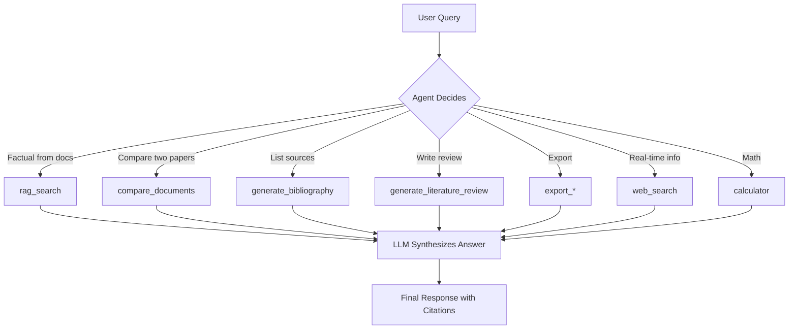

# Aloysia — Academic Research Agent with Agentic RAG

**Aloysia** is a full-stack, agentic literature research assistant that goes beyond simple Q&A. It ingests academic documents, builds a **page-aware knowledge base**, and uses a **LangGraph-powered agent** to autonomously decide when to search internal documents, compare sources, generate literature reviews, export bibliographies, or fetch real-time web data — all with **publication-grade citations**.

Built for researchers, clinicians, and students in health-tech and life sciences, Aloysia turns scattered PDFs and papers into structured, citable insights — automatically.

---

## What Aloysia Does

| Capability | Description |
|----------|-----------|
| **Document Ingestion** | Loads `.pdf`, `.docx`, `.txt`, `.md` with **rich metadata extraction** (title, author, creation date, page count) |
| **Page-Level RAG** | Splits documents into chunks, embeds with `all-MiniLM-L6-v2`, stores **per-chunk metadata** (page, section, source) |
| **Cross-Encoder Reranking** | Re-ranks retrieval results for higher relevance using `ms-marco-MiniLM-L-6-v2` |
| **Agentic Reasoning** | LangGraph state machine decides tool use: RAG → Web → Compare → Export |
| **8 Specialized Tools** | `rag_search`, `compare_documents`, `generate_bibliography`, `export_literature_review`, etc. |
| **Multi-Format Export** | Generates **Word**, **LaTeX**, **Markdown** bibliographies and full **literature reviews** |
| **Web Integration** | Tavily-powered real-time search for current guidelines, news, or updates |
| **Citation Tracking** | Every claim includes: `Source: amr.pdf, Page: 5, Section: Mechanisms` |

---

## How It Works (Agentic Workflow)




## Project Structure
```bash
aloysia/
├── code/
│   ├── app.py              # Core RAG assistant + agent initialization
│   ├── db.py               # VectorDB with Chroma, embeddings, reranking
│   ├── export_utils.py     # Bibliography & literature review exporters
│   ├── agent.py            # LangGraph agent, tools, workflow
│   ├── __init__.py
│   └── .env                # API keys & config
├── data/                   # Drop your PDFs, DOCX, etc. here
│   ├── amr.pdf
│   ├── dysmenorrhea.docx
│   └── guidelines.md
├── chroma_db/              # Persistent vector store (auto-created)
└── requirements.txt
```

## Installation
### 1. Clone the repository
```bash
git clone https://github.com/Nago-01/rag_assistant.git
cd rag_assistant
```

### 2. Create virtual environment
```bash
# Unix/macOS
python -m venv .venv
source .venv/bin/activate

# Windows
python -m venv .venv
.venv\Scripts\Activate.ps1
```


### 3. Install dependencies
```bash
pip install -r requirements.txt
```

### Set Up `.env`
```
# LLM Providers (one required)
GROQ_API_KEY=your_groq_key
GROQ_MODEL=llama-3.3-70b-versatile

# OR
GEMINI_API_KEY=your_gemini_key
GEMINI_MODEL=gemini-2.0-flash-exp

# Optional: Real-time web search
TAVILY_API_KEY=your_tavily_key

# Embedding & DB
EMBEDDING_MODEL=sentence-transformers/all-MiniLM-L6-v2
CHROMA_COLLECTION_NAME=rag_documents
```

## Usage
### Add Documents
Place your research papers in the `data/` folder
```
data/
├── antimicrobial_resistance.pdf
├── pcos_clinical_guidelines.docx
└── who_amr_report_2025.md
```

### Run Aloysia
```bash
python -m code.agent
```

### Example Session
```
Agentic RAG Assistant with LangGraph
Initializing agent...
Loaded 3 documents into knowledge base.

You: Compare AMR and PCOS papers on treatment options
Assistant: 
COMPARISON: antimicrobial_resistance.pdf vs pcos_clinical_guidelines.docx on 'treatment'

AMR.pdf:
1. Source: antimicrobial_resistance.pdf, Page: 12, Author: WHO
   "Antibiotic stewardship programs reduced resistance by 23%..."

PCOS.docx:
1. Source: pcos_clinical_guidelines.docx, Page: 8, Author: AES
   "Metformin and lifestyle intervention improved ovulation in 68%..."

You: Write a literature review on antimicrobial resistance and export as Word
Assistant: Literature review exported to WORD: literature_review_antimicrobial_resistance.docx

You: What’s the latest WHO stance on AMR?
Assistant: [Uses web_search] According to WHO (Nov 2025): "Global AMR deaths projected to reach 10M by 2050..."
```

### Tools and Commands (Natural Language)

| Ask This | Aloysia Does This |
|----------|-------------------|
| `"What does the AMR paper say on page 5?"` | `rag_search` with citation |
| `"Compare AMR and Dysmenorrhea on causes"` | `compare_documents` |
| `"Show bibliography"` | `generate_bibliography` |
| `"Export references as LaTeX"` | `export_bibliography(format="latex")` |
| `"Write a review on PCOS"` | `generate_literature_review` + synthesis |
| `"Save review as Markdown"` | `export_literature_review(format="md")` |
| `"Calculate 68% of 250 patients"` | `calculator` |


### Tech Stack

| Layer | Tool |
|-------|------|
| **LLM** | Groq (`llama-3.3-70b`) or Gemini (`2.0-flash`) |
| **Embeddings** | `all-MiniLM-L6-v2` |
| **Reranking** | `ms-marco-MiniLM-L-6-v2` |
| **Vector DB** | ChromaDB (persistent) |
| **Agent Framework** | LangGraph |
| **Document Parsing** | PyPDF2, python-docx |
| **Export** | python-docx, LaTeX, Markdown |
| **Web Search** | Tavily |
| **CLI** | Built-in interactive loop |


## For Health-Tech and Research
- Clinical trial document analysis
- Guideline compliance checking
- Pharmacovigilance reporting
- Medical education content generation
- Real-time drug policy updates


## License
MIT

